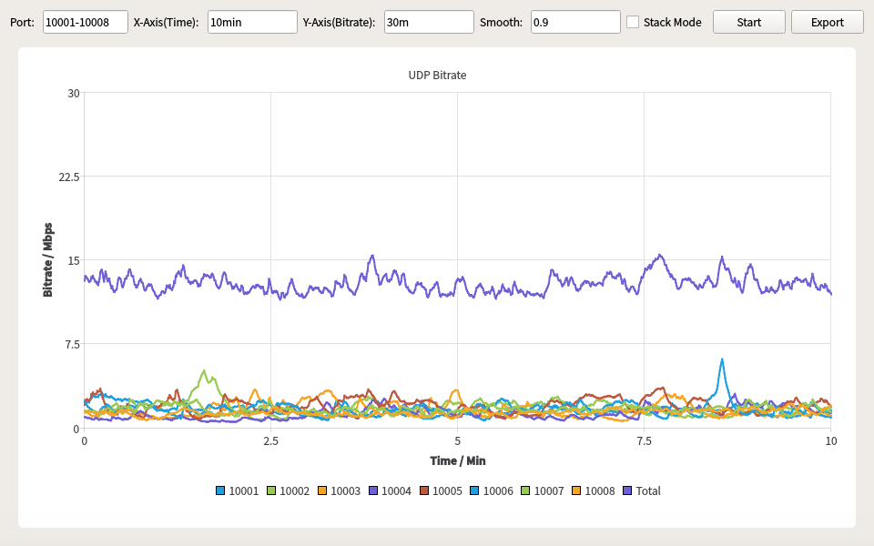
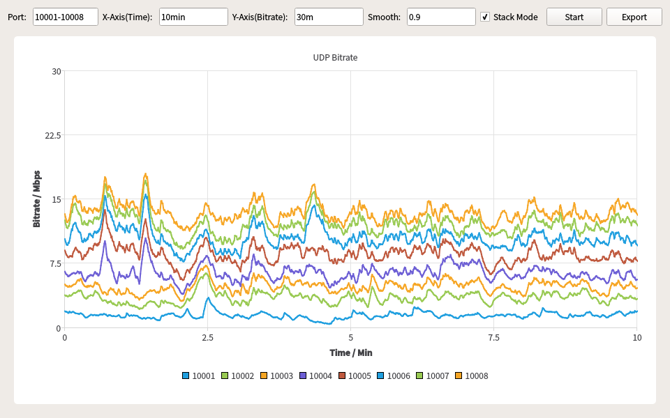

# UDP Bitrate

UDP Bitrate is a useful tool to count the length of data received from UDP ports and plot it in real time.

Requirements:
--------
- Python 3
- PyQt5
- PyQtChart

Running:
--------
Before use, you need to execute the following command to install PyQt5 and PyQtChart.
```
sudo pip3 install -r requirements.txt
```

Then you can run the tool by the following command:
```
python3 udpbitrate.py
```

Configuration Description:
--------
- **Port**
    - Specifying UDP ports for receiving.
    - Example: 10001-10008 *or* 10001,10002,10003

- **X-Axis(Time)**
    - Specifying the full range of X axis.
    - Example: 1000sec *or* 10min 

- **Y-Axis(Bitrate)**
    - Specifying the full range of Y axis.
    - Example: 1000k *or* 10m

- **Stack Mode**
    - Specifying to use normal mode or stack mode.
    - **Normal**: Display the bitrates of each port independently, and the sum of the bitrates.
    
    - **Stack**: Curves of each bitrate are overlying on the previous one.
    
